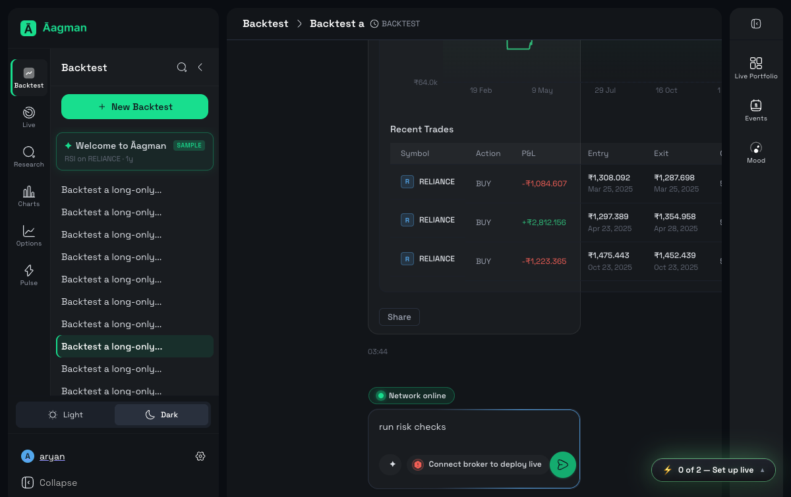
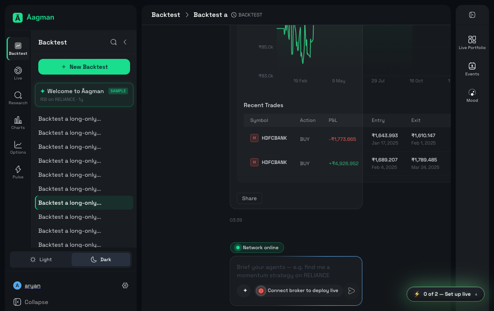
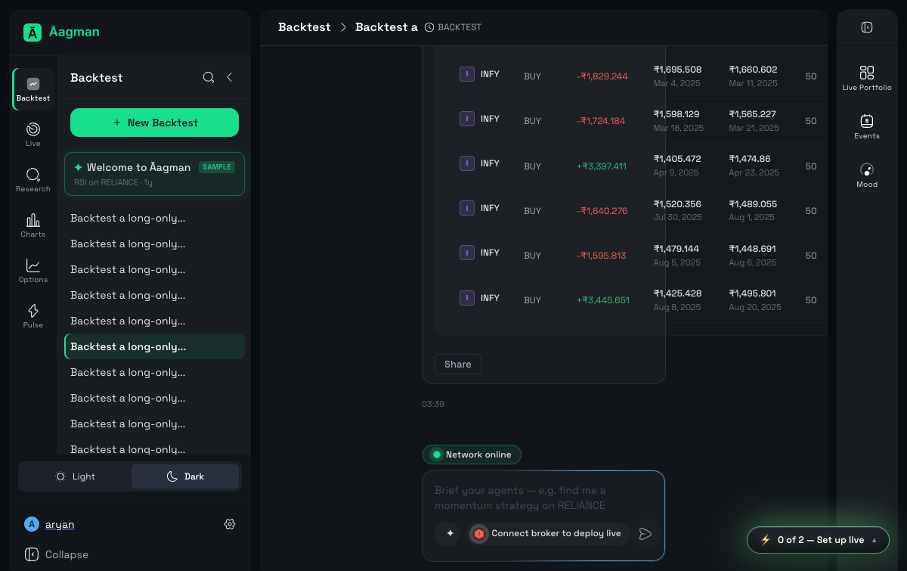
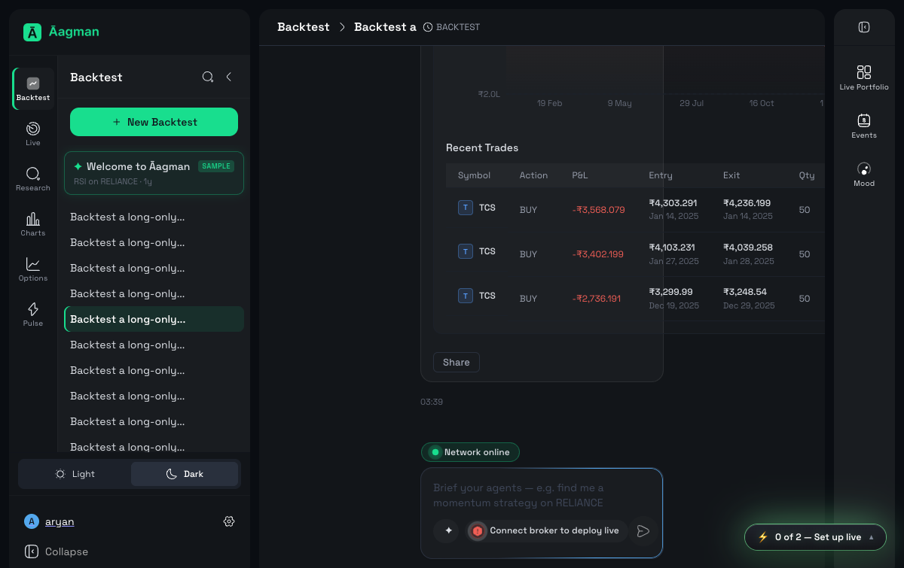
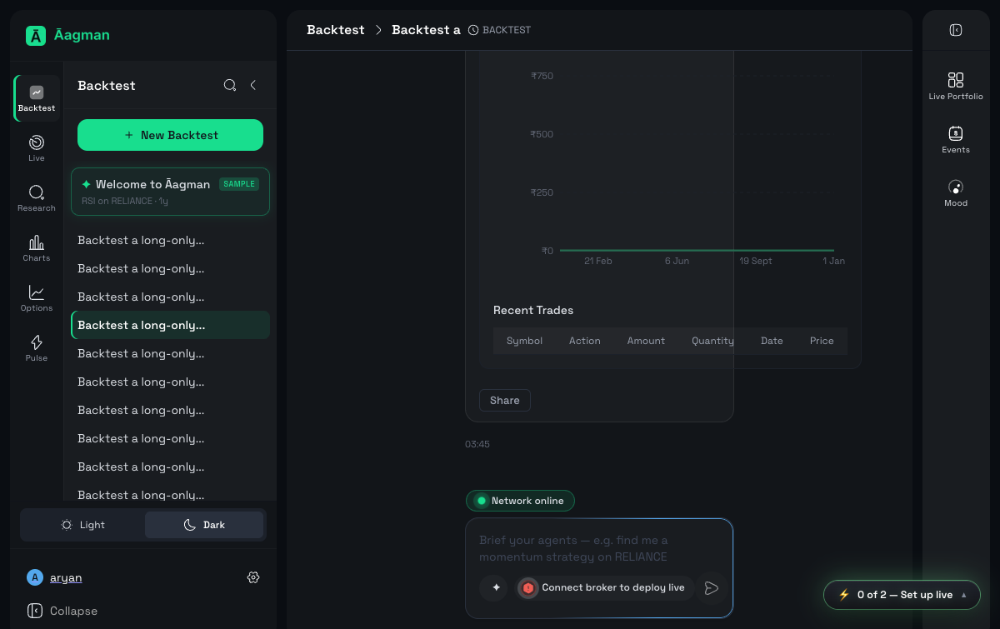
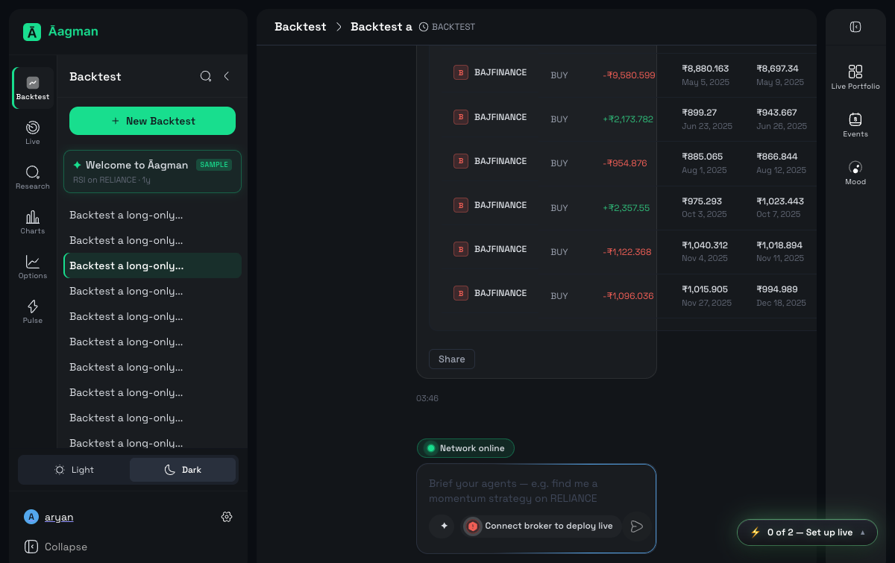
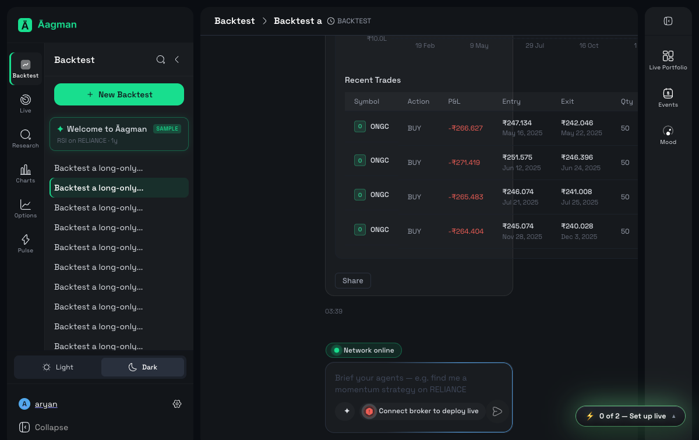
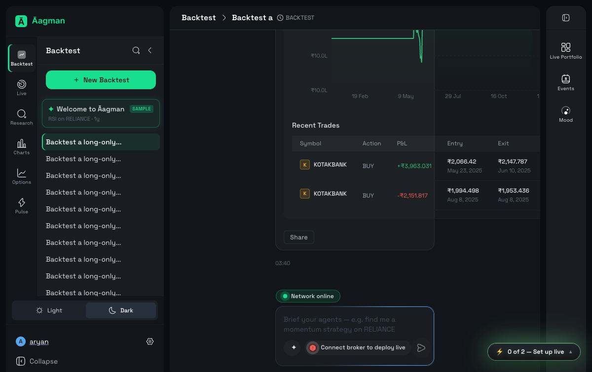

# Aagman QA Report — backtest-mixed-8

- **Run ID:** `2026-07-11-033054-staging-backtest-mixed-8-1d43a9`
- **Environment:** staging (https://app.staging.v2.aagman.ai)
- **Timestamp:** 2026-07-10T22:17:05.271771+00:00
- **Total:** 8 | ✅ Pass: 8 | ❌ Fail: 0 | 🚧 Blocked: 0 | ⚠️ Error: 0

## Summary

| ID | Status | Duration | Message |
|---|---|---|---|
| bt-1.1-ema-crossover | ✅ PASS | 828.73s | — |
| bt-1.2-rsi-mean-reversion | ✅ PASS | 818.6s | — |
| bt-1.3-bollinger-rsi | ✅ PASS | 808.61s | — |
| bt-1.4-macd-momentum | ✅ PASS | 797.97s | — |
| bt-1.5-adx-trend | ✅ PASS | 832.09s | — |
| bt-1.6-stochastic-crossover | ✅ PASS | 898.72s | — |
| bt-1.7-parabolic-sar | ✅ PASS | 888.26s | — |
| bt-1.8-hammer-rsi-sma | ✅ PASS | 877.83s | — |

## Details

### bt-1.1-ema-crossover — PASS (828.73s)

**Logs:**
- Batch 1: prompt submitted; workspace=https://app.staging.v2.aagman.ai/trading-strategy/6a2f4696-ed2e-49fb-96af-fec1ec1d0b25
- Backtest report card detected after batch settle

**Screenshots:**
- `screenshots/bt-1.1-ema-crossover_pass.png`
  

### bt-1.2-rsi-mean-reversion — PASS (818.6s)

**Logs:**
- Batch 1: prompt submitted; workspace=https://app.staging.v2.aagman.ai/trading-strategy/cf3984f9-0b20-42d7-bb1f-580afae26106
- Backtest report card detected after batch settle

**Screenshots:**
- `screenshots/bt-1.2-rsi-mean-reversion_pass.png`
  

### bt-1.3-bollinger-rsi — PASS (808.61s)

**Logs:**
- Batch 1: prompt submitted; workspace=https://app.staging.v2.aagman.ai/trading-strategy/62e700c0-79b5-45e3-a19a-46aa2f0dfd3d
- Backtest report card detected after batch settle

**Screenshots:**
- `screenshots/bt-1.3-bollinger-rsi_pass.png`
  

### bt-1.4-macd-momentum — PASS (797.97s)

**Logs:**
- Batch 1: prompt submitted; workspace=https://app.staging.v2.aagman.ai/trading-strategy/eb170dbe-01ae-4740-a89c-3ba67acdca1a
- Backtest report card detected after batch settle

**Screenshots:**
- `screenshots/bt-1.4-macd-momentum_pass.png`
  

### bt-1.5-adx-trend — PASS (832.09s)

**Logs:**
- Batch 1: prompt submitted; workspace=https://app.staging.v2.aagman.ai/trading-strategy/82473de8-0ee4-4324-ba4a-241f2c297f0f
- Backtest report card detected after batch settle

**Screenshots:**
- `screenshots/bt-1.5-adx-trend_pass.png`
  

### bt-1.6-stochastic-crossover — PASS (898.72s)

**Logs:**
- Batch 1: prompt submitted; workspace=https://app.staging.v2.aagman.ai/trading-strategy/e979ad40-86f8-4fc1-bfa3-85445248cc3e
- Backtest report card detected after batch settle

**Screenshots:**
- `screenshots/bt-1.6-stochastic-crossover_pass.png`
  

### bt-1.7-parabolic-sar — PASS (888.26s)

**Logs:**
- Batch 1: prompt submitted; workspace=https://app.staging.v2.aagman.ai/trading-strategy/6529e2f9-cc49-4aa8-b3f6-cf6d77d3a78a
- Backtest report card detected after batch settle

**Screenshots:**
- `screenshots/bt-1.7-parabolic-sar_pass.png`
  

### bt-1.8-hammer-rsi-sma — PASS (877.83s)

**Logs:**
- Batch 1: prompt submitted; workspace=https://app.staging.v2.aagman.ai/trading-strategy/96ce7eeb-2669-48b7-b3af-cc4554f0bd53
- Backtest report card detected after batch settle

**Screenshots:**
- `screenshots/bt-1.8-hammer-rsi-sma_pass.png`
  
