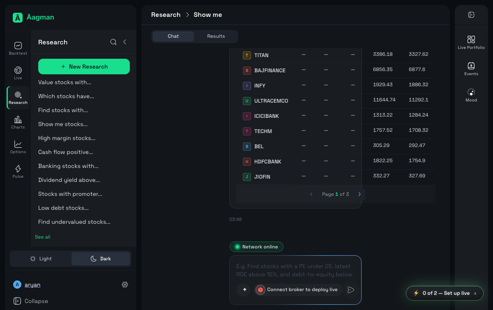
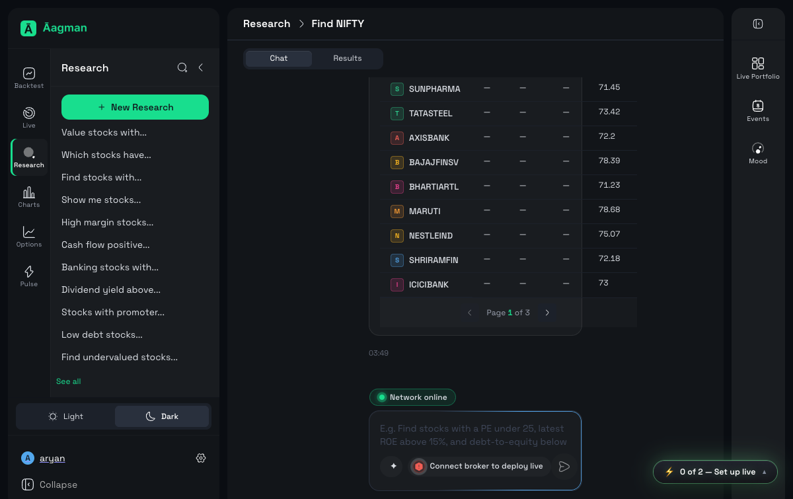
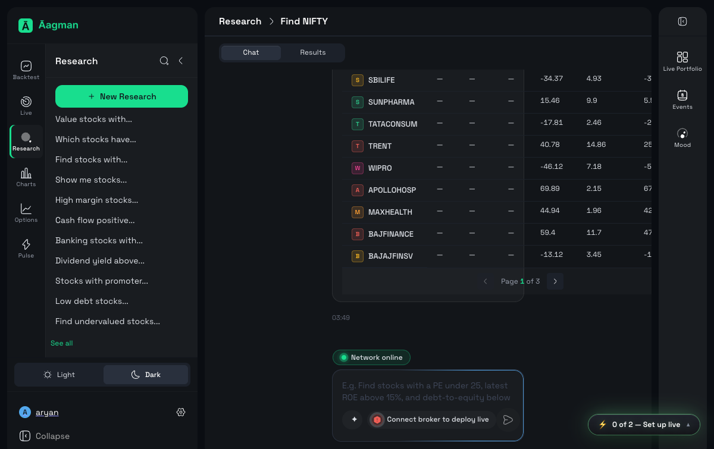
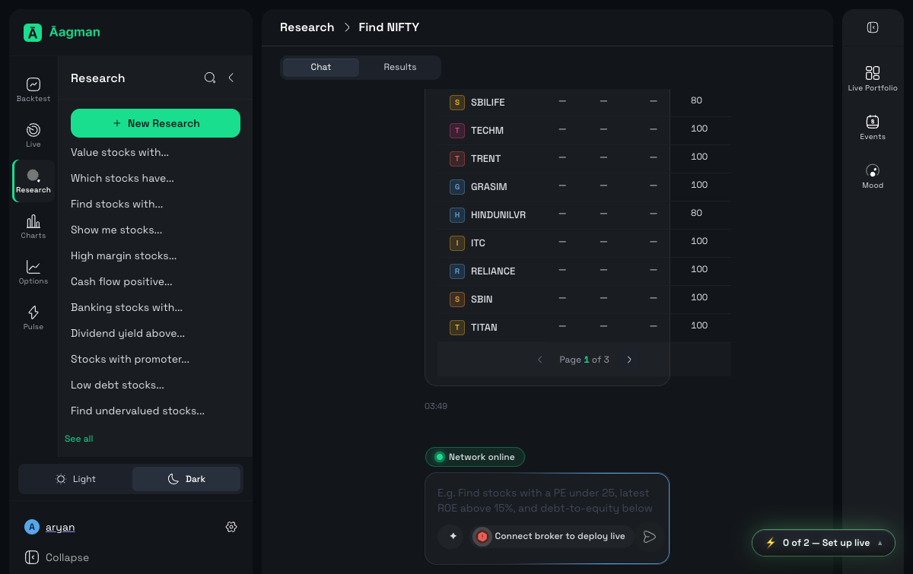
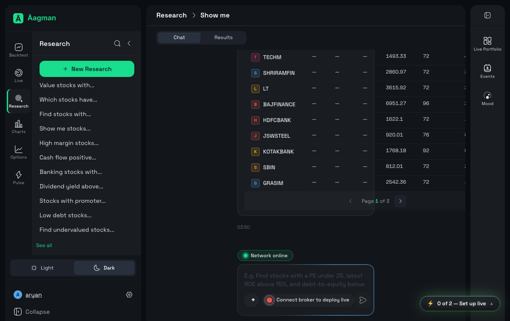

# Aagman QA Report — research-mixed-7

- **Run ID:** `2026-07-11-034738-staging-research-mixed-7-408af8`
- **Environment:** staging (https://app.staging.v2.aagman.ai)
- **Timestamp:** 2026-07-10T22:27:53.023848+00:00
- **Total:** 7 | ✅ Pass: 7 | ❌ Fail: 0 | 🚧 Blocked: 0 | ⚠️ Error: 0

## Summary

| ID | Status | Duration | Message |
|---|---|---|---|
| rs-8.1-sma-trend-filter | ✅ PASS | 580.73s | — |
| rs-8.2-rsi-overbought | ✅ PASS | 571.66s | — |
| rs-8.3-macd-histogram-positive | ✅ PASS | 562.85s | — |
| rs-8.4-stochastic-crossover | ✅ PASS | 554.06s | — |
| rs-8.5-bullish-engulfing | ✅ PASS | 545.11s | — |
| rs-8.6-adx-strong-trend | ✅ PASS | 536.31s | — |
| rs-8.7-aroon-bullish-trend | ✅ PASS | 527.47s | — |

## Details

### rs-8.1-sma-trend-filter — PASS (580.73s)

**Logs:**
- Batch 1: starting new research chat
- Batch 1: prompt submitted; workspace=https://app.staging.v2.aagman.ai/screener/e0bd7aca-634c-480c-b1eb-177a16b9e90c
- Result detected after batch settle

**Screenshots:**
- `screenshots/rs-8.1-sma-trend-filter_pass.png`
  

### rs-8.2-rsi-overbought — PASS (571.66s)

**Logs:**
- Batch 1: starting new research chat
- Batch 1: prompt submitted; workspace=https://app.staging.v2.aagman.ai/screener/950a8213-f74c-4da9-a8b1-39dd2768aad3
- Result detected after batch settle

**Screenshots:**
- `screenshots/rs-8.2-rsi-overbought_pass.png`
  

### rs-8.3-macd-histogram-positive — PASS (562.85s)

**Logs:**
- Batch 1: starting new research chat
- Batch 1: prompt submitted; workspace=https://app.staging.v2.aagman.ai/screener/09dbea36-420a-4f9d-81e9-33697215f76e
- Result detected after batch settle

**Screenshots:**
- `screenshots/rs-8.3-macd-histogram-positive_pass.png`
  

### rs-8.4-stochastic-crossover — PASS (554.06s)

**Logs:**
- Batch 1: starting new research chat
- Batch 1: prompt submitted; workspace=https://app.staging.v2.aagman.ai/screener/4e9cf0ef-6de8-4bfb-bc7c-8c5612c80441
- Result detected after batch settle

**Screenshots:**
- `screenshots/rs-8.4-stochastic-crossover_pass.png`
  

### rs-8.5-bullish-engulfing — PASS (545.11s)

**Logs:**
- Batch 1: starting new research chat
- Batch 1: prompt submitted; workspace=https://app.staging.v2.aagman.ai/screener/68bf0f3b-482c-495d-9a76-87a02280509e
- Result detected after batch settle

**Screenshots:**
- `screenshots/rs-8.5-bullish-engulfing_pass.png`
  

### rs-8.6-adx-strong-trend — PASS (536.31s)

**Logs:**
- Batch 1: starting new research chat
- Batch 1: prompt submitted; workspace=https://app.staging.v2.aagman.ai/screener/9916938f-fac7-4885-b01b-e7532c432206
- Result detected after batch settle

**Screenshots:**
- `screenshots/rs-8.6-adx-strong-trend_pass.png`
  

### rs-8.7-aroon-bullish-trend — PASS (527.47s)

**Logs:**
- Batch 1: starting new research chat
- Batch 1: prompt submitted; workspace=https://app.staging.v2.aagman.ai/screener/ae28d730-94bf-43a0-a958-10a19901223f
- Result detected after batch settle

**Screenshots:**
- `screenshots/rs-8.7-aroon-bullish-trend_pass.png`
  
