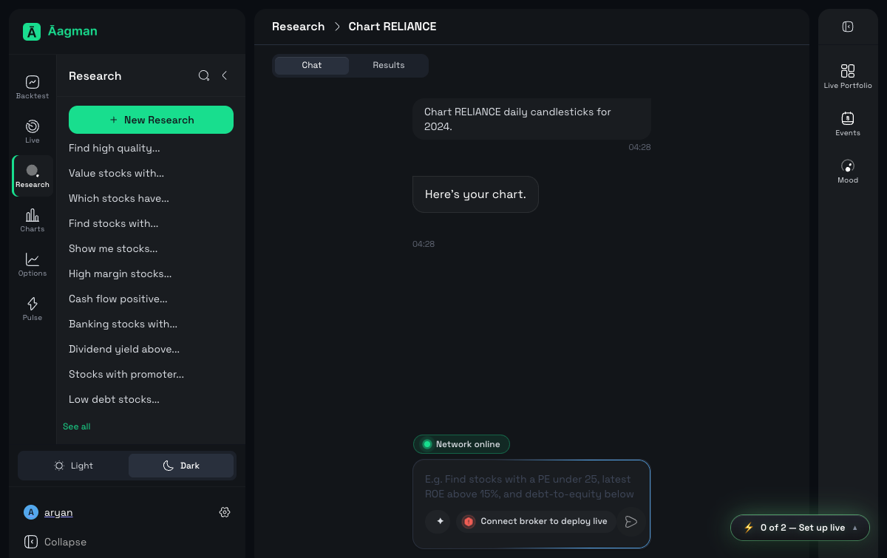
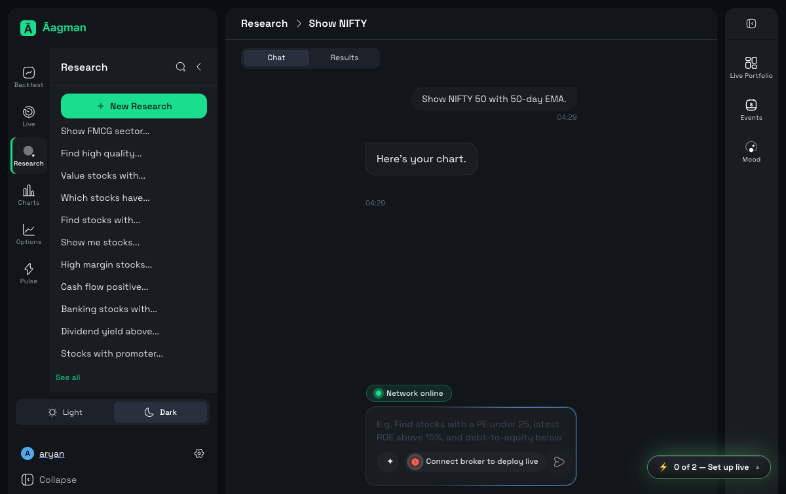
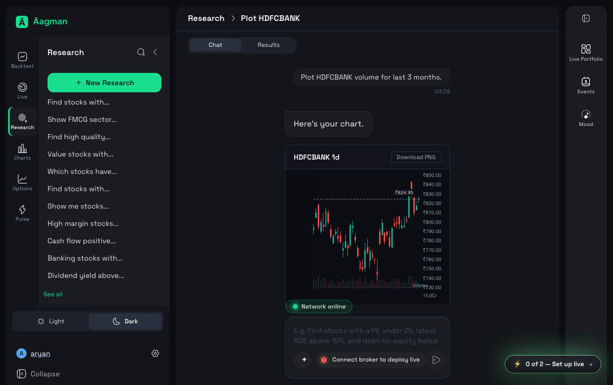
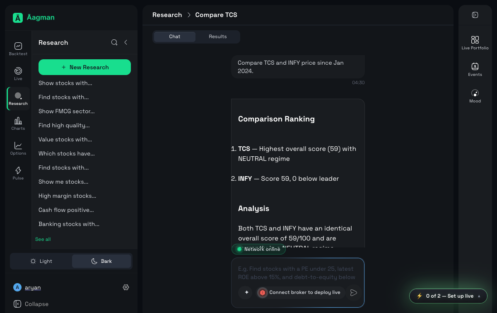
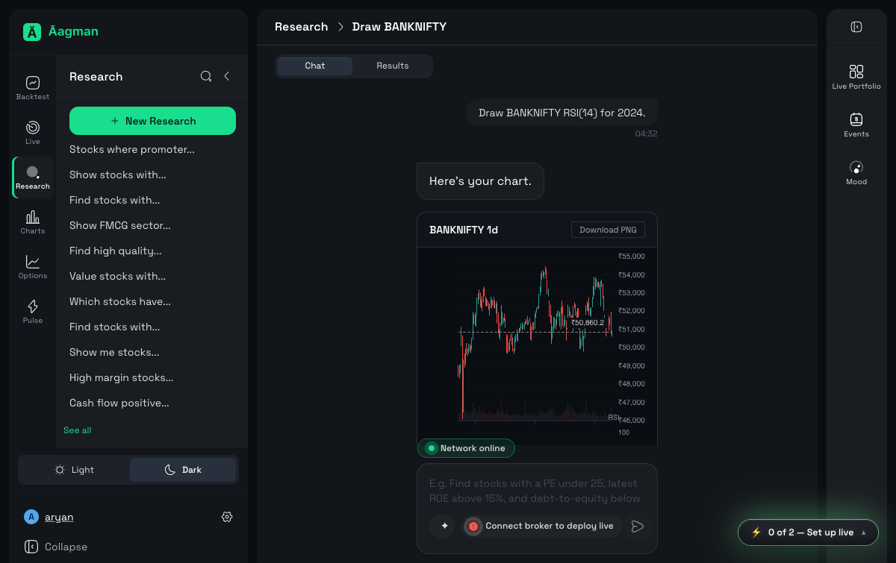

# Aagman QA Report — chart-mixed-5

- **Run ID:** `2026-07-11-042822-staging-chart-mixed-5-4bf818`
- **Environment:** staging (https://app.staging.v2.aagman.ai)
- **Timestamp:** 2026-07-10T23:03:02.687539+00:00
- **Total:** 5 | ✅ Pass: 2 | ❌ Fail: 3 | 🚧 Blocked: 0 | ⚠️ Error: 0

## Summary

| ID | Status | Duration | Message |
|---|---|---|---|
| ch-1-reliance-candlesticks | ❌ FAIL | 46.61s | Vision verification failed: The screen shows only the chat message 'Here's your chart.' but no actual rendered candlestick, line, bar, or OHLC chart is visible. |
| ch-2-nifty-ema | ❌ FAIL | 39.56s | Vision verification failed: The response says 'Here's your chart' but no actual chart, candlestick, line, bar, or OHLC table is visible in the screenshot. |
| ch-3-hdfcbank-volume | ✅ PASS | 28.88s | — |
| ch-4-tcs-infy-compare | ❌ FAIL | 133.52s | Timed out waiting for assistant response |
| ch-5-banknifty-rsi | ✅ PASS | 29.43s | — |

## Details

### ch-1-reliance-candlesticks — FAIL (46.61s)

**Message:** Vision verification failed: The screen shows only the chat message 'Here's your chart.' but no actual rendered candlestick, line, bar, or OHLC chart is visible.

**Logs:**
- Navigated to Research
- Started new research chat
- Submitted prompt: Chart RELIANCE daily candlesticks for 2024....
- Assistant response: Here's your chart....
- Waiting 6.0s for chart render
- Screenshot captured: reports/2026-07-11-042822-staging-chart-mixed-5-4bf818/screenshots/ch-1-reliance-candlesticks_chart.png
- Vision verdict: no — The screenshot only shows chat messages about a chart; no actual candlestick, line, bar, or OHLC chart is visible.
- Chart not visible, waiting 10.0s and retrying
- Vision verdict (retry): no — The screen shows only the chat message 'Here's your chart.' but no actual rendered candlestick, line, bar, or OHLC chart is visible.
- Failure screenshot: reports/2026-07-11-042822-staging-chart-mixed-5-4bf818/screenshots/ch-1-reliance-candlesticks_fail.png

**Screenshots:**
- `screenshots/ch-1-reliance-candlesticks_chart.png`
  
- `screenshots/ch-1-reliance-candlesticks_fail.png`
  

### ch-2-nifty-ema — FAIL (39.56s)

**Message:** Vision verification failed: The response says 'Here's your chart' but no actual chart, candlestick, line, bar, or OHLC table is visible in the screenshot.

**Logs:**
- Navigated to Research
- Started new research chat
- Submitted prompt: Show NIFTY 50 with 50-day EMA....
- Assistant response: Here's your chart....
- Waiting 6.0s for chart render
- Screenshot captured: reports/2026-07-11-042822-staging-chart-mixed-5-4bf818/screenshots/ch-2-nifty-ema_chart.png
- Vision verdict: no — The chat only shows the text 'Here's your chart.' without any visible candlestick, line, bar, or OHLC chart.
- Chart not visible, waiting 10.0s and retrying
- Vision verdict (retry): no — The response says 'Here's your chart' but no actual chart, candlestick, line, bar, or OHLC table is visible in the screenshot.
- Failure screenshot: reports/2026-07-11-042822-staging-chart-mixed-5-4bf818/screenshots/ch-2-nifty-ema_fail.png

**Screenshots:**
- `screenshots/ch-2-nifty-ema_chart.png`
  
- `screenshots/ch-2-nifty-ema_fail.png`
  

### ch-3-hdfcbank-volume — PASS (28.88s)

**Logs:**
- Navigated to Research
- Started new research chat
- Submitted prompt: Plot HDFCBANK volume for last 3 months....
- Assistant response: Here's your chart....
- Waiting 6.0s for chart render
- Screenshot captured: reports/2026-07-11-042822-staging-chart-mixed-5-4bf818/screenshots/ch-3-hdfcbank-volume_chart.png
- Vision verdict: yes — The screenshot displays a visible HDFCBANK candlestick price chart with price axis and volume bars.

**Screenshots:**
- `screenshots/ch-3-hdfcbank-volume_chart.png`
  

### ch-4-tcs-infy-compare — FAIL (133.52s)

**Message:** Timed out waiting for assistant response

**Logs:**
- Navigated to Research
- Started new research chat
- Submitted prompt: Compare TCS and INFY price since Jan 2024....
- Failure screenshot: reports/2026-07-11-042822-staging-chart-mixed-5-4bf818/screenshots/ch-4-tcs-infy-compare_fail.png

**Screenshots:**
- `screenshots/ch-4-tcs-infy-compare_fail.png`
  

### ch-5-banknifty-rsi — PASS (29.43s)

**Logs:**
- Navigated to Research
- Started new research chat
- Submitted prompt: Draw BANKNIFTY RSI(14) for 2024....
- Assistant response: Here's your chart....
- Waiting 6.0s for chart render
- Screenshot captured: reports/2026-07-11-042822-staging-chart-mixed-5-4bf818/screenshots/ch-5-banknifty-rsi_chart.png
- Vision verdict: yes — The screenshot displays a BANKNIFTY candlestick price chart with price levels on the y-axis.

**Screenshots:**
- `screenshots/ch-5-banknifty-rsi_chart.png`
  
